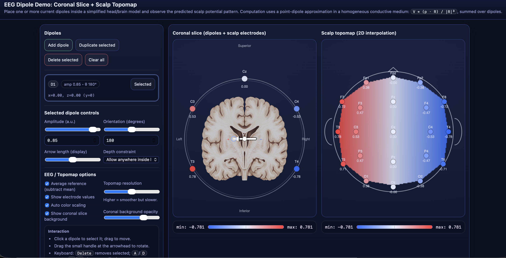

# EEG Dipole Simulator & Anatomical Demo

A lightweight, interactive web-based tool designed to build an intuitive understanding of **EEG forward modeling**. This simulation visualizes how a neural source (modeled as a current dipole) generates electrical potentials across the scalp, bridging the gap between underlying brain activity and the waveforms seen on an EEG monitor.

It features a Zero-Dependency architecture, contained entirely within a single HTML file for easy sharing and offline use.

## 🎯 Purpose

Understanding EEG requires grasping the "Inverse Problem" (guessing the source from the scalp) and the "Forward Problem" (calculating the scalp potential from a known source). This tool visualizes the **Forward Problem** in real-time, helping students and researchers understand:

* **Dipole Orientation:** The difference between Radial and Tangential sources.
* **Volume Conduction:** How the skull and scalp attenuate and smear electrical fields.
* **Montage Geometry:** The relationship between a coronal slice (T3-C3-Cz-C4-T4) and the full 10-20 scalp topomap.
* **Reference Issues:** How switching to an "Average Reference" changes the observed potentials.

## ✨ Key Features

* **Dual-View Visualization:**
  * **Coronal View (Left):** A cross-sectional anatomical view showing the brain, skull, and scalp layers. It highlights the "Coronal Chain" of electrodes (T3, C3, Cz, C4, T4).
  * **Scalp Topomap (Right):** A classic 2D heatmap (interpolation) of the voltage distribution across a standard 10-20 electrode montage.
* **Interactive Physics:**
  * **Move the Source:** Drag the dipole X/Y position to see how depth affects signal strength and spread.
  * **Rotate Orientation:** Adjust the dipole angle to simulate radial vs. tangential activity.
  * **Adjust Strength:** Change the dipole moment to see signal-to-noise impacts.
* **Real-Time Rendering:**
  * Instantaneous calculation of potential fields.
  * Dynamic plotting of electric field lines (streamlines).
* **Customization:**
  * Toggle **Average Reference** calculation.
  * Show/Hide electrode labels.
  * Auto-rotate animation mode.

## 🚀 Quick Start

There is no build process, no `npm install`, and no server required.

1. **Download** the `eeg_dipole_demo_anatomical_v11.html` file.
2. **Open** the file in any modern web browser (Chrome, Firefox, Safari, Edge).
3. **Interact** with the sliders on the right panel to simulate brain activity.

## 🛠️ Technical Details

* **Stack:** Vanilla JavaScript, HTML5 Canvas.
* **Dependencies:** None.
* **Math:**
  * The simulation approximates a multi-shell spherical head model.
  * Potentials are calculated using the inverse-square law modified for conductive layers (Brain $\to$ Skull $\to$ Scalp).
  * Topographic mapping utilizes Inverse Distance Weighting (IDW) for smooth heatmap interpolation between electrode sites.

## 🎮 Controls Guide

| Control | Function |
| :--- | :--- |
| **Source X / Y** | Moves the dipole location within the coronal slice. |
| **Orientation** | Rotates the dipole (0° = Up/Radial, 90° = Right/Tangential). |
| **Moment** | Increases or decreases the simulated current strength. |
| **Field Lines** | Toggles the visualization of current flow lines in the coronal view. |
| **Avg Ref** | Re-calculates potentials by subtracting the mean of all electrodes (Common Average Reference). |
| **Auto-Rotate** | Automatically spins the dipole to demonstrate changing field polarities. |

## 📄 License

Distributed under the MIT License. See `LICENSE` for more information.

---

**Developed for educational purposes in Neuroscience and Signal Processing.**
